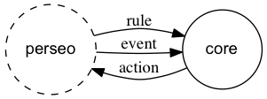

# Architecture

This component is a Java Web application, distributed as a war. It could be seen as a "Rules Engine". The main purpose of this component is to receive the events through a POST containing the JSON representation of the event and apply the rules so that they can generate appropriate actions by means of a POST request to another component with the appropriate information. The rules are also provisioned through a POST request with the expression of the rule in **EPL**. EPL is the language of rules of [Esper](http://www.espertech.com/products/esper.php). Esper is the Java library that contains the rules engine and event processing logic. Basically the component is a wrapper for the Esper library, providing a REST API and a persistent context (in memory).





## Events triggered (fired rules)

When an incoming event fired a rule, the values selected by the EPL statement are sent as a JSON to an URL set in the configuration file. This composed object is an event, derived from the input events.
If more than one rule is fired, each one will generate its own "complex" event and will cause an HTTP POST to the predefined URL. This URL is the same regardless the  rule or the complex event.

### Example

Being this rule working
```SQL
@Audit
select *,"blood_1_action" as iotcepaction,
    ev.BloodPressure? as Pression,
	ev.id? as Meter
from pattern [
    every ev=iotEvent(cast(cast(BloodPressure?,String),float)>1.5
	and type="BloodMeter")
	]
```
and sending an event
```JSON
{
   "noticeId":"32f607c0-1d3e-11e4-9ac7-afdfe453cabd",
   "received":"2014-08-06T07:49:30.812Z",
   "id":"bloodm1",
   "type":"BloodMeter",
   "isPattern":"false",
   "BloodPressure":"2",
   "BloodPressure__type":"centigrade",
   "complex":{
      "greeting":"....Orion el Grande!!",
      "nested":{
         "x":23
      }
   },
   "TimeInstant":"2014-04-29T13:18:05Z",
   "TimeInstant__type":"urn:x-ogc:def:trs:IDAS:1.0:ISO8601",
}
```
a complex event would be POSTed to the configured URL
```JSON
{
   "Meter":"bloodm1",
   "ev":{
      "BloodPressure":"2",
      "TimeInstant__type":"urn:x-ogc:def:trs:IDAS:1.0:ISO8601",
      "received":"2014-08-06T07:49:30.812Z",
      "type":"BloodMeter",
      "isPattern":"false",
      "id":"bloodm1",
      "complex":{
         "greeting":"....Orion el Grande!!",
         "nested":{
            "x":23
         }
      },
      "noticeId":"32f607c0-1d3e-11e4-9ac7-afdfe453cabd",
      "BloodPressure__type":"centigrade",
      "TimeInstant":"2014-04-29T13:18:05Z"
   },
   "Pression":"2",
   "iotcepaction":"blood_1_action"
}
```
